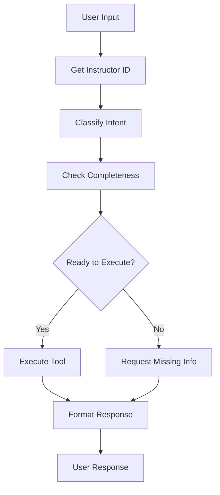

# ExamBuilder LangGraph Agent

A sophisticated LangGraph-based agent that integrates with the ExamBuilder API to provide natural language interfaces for exam management, student administration, and educational analytics.

## 🎓 Features

### Student Management

- **Student Search**: Find students by name or other criteria
- **Student Details**: Retrieve comprehensive student profiles

### Exam Management

- **List Exams**: View all available exams
- **Exam Details**: Get comprehensive exam information
- **Exam Statistics**: Access detailed performance metrics

### Group Management

- **List Groups**: View all student groups
- **Group Details**: Get group information

### System Management

- **System Status**: View API connection status and available resources
- **Help System**: Interactive capability discovery

## 🏗️ Architecture

The agent uses a **LangGraph workflow** with the following nodes:

1. **Instructor ID Node**: Authenticates and retrieves instructor credentials
2. **Intent Classification**: Uses LLM to understand user requests
3. **Information Completeness**: Validates required parameters
4. **Tool Execution**: Calls appropriate ExamBuilder API endpoints
5. **Response Formatting**: Presents results in user-friendly format

## 📁 Project Structure

```
exam-agent/
├── exambuilder_tools.py      # ExamBuilder API functions
├── exambuilder_agent.py      # LangGraph workflow implementation
├── exambuilder_demo.py       # Interactive demo script
├── README.md                 # This file
└── requirements.txt          # Python dependencies
```

## Setup

### 1. Install Dependencies

```bash
pip install -r requirements.txt
```

### 2. Set Environment Variables

Create a `.env` file in the project root with your API keys:

```bash
# Copy the example file
cp .env.example .env

# Edit the .env file with your actual API keys
nano .env
```

Required environment variables:
- `OPENAI_API_KEY`: Your OpenAI API key (required)
- `LANGSMITH_API_KEY`: Your LangSmith API key (optional, for telemetry)
- `LANGSMITH_PROJECT`: LangSmith project name (optional, defaults to "exambuilder-agent")

**Important**: Never commit your `.env` file to version control. It's already in `.gitignore`.

The ExamBuilder API credentials are already configured in the code, but you can override them if needed:

```bash
export EXAMBUILDER_API_KEY="your_exambuilder_api_key"
export EXAMBUILDER_API_SECRET="your_exambuilder_api_secret"
```

### 3. Run the Agent

#### Interactive Demo

```bash
python exambuilder_demo.py
```

#### Comprehensive Test Suite

```bash
python test_complete_workflow.py
```

#### Direct Usage

```python
from exambuilder_agent import run_exambuilder_agent_v2, reset_conversation

# Reset conversation state
reset_conversation()

# Run a query
response = run_exambuilder_agent_v2("What can you help me with?")
print(response)
```

### Example Conversations

**System Capabilities:**

```
User: "What can you help me with?"
Agent: "🎓 ExamBuilder Agent Capabilities:
        1. List all available exams
        2. Get detailed exam information
        3. List all students
        4. Get detailed student information
        5. List group categories
        6. Show system status"
```

**Listing Exams:**

```
User: "List all available exams"
Agent: "📝 Found 3 exam(s):

        1. **Pearson Test 1**
           • ID: `0344b2749fc8e3118d04269aa02d2675`
           • State: Inactive
           • Created: 28-JUL-2025"
```

## 🔧 API Integration

### ExamBuilder API Endpoints

The agent integrates with these verified working ExamBuilder API endpoints:

- **Authentication**: `GET /validate.json` ✅
- **Exams**: `GET /instructor/{id}/exam/list.json` ✅
- **Exam Details**: `GET /instructor/{id}/exam/{exam_id}.json` ✅
- **Students**: `GET /instructor/{id}/student/list.json` ✅
- **Student Details**: `GET /instructor/{id}/student/{student_id}.json` ✅
- **Groups**: `GET /instructor/{id}/category/list.json` ✅

### Error Handling

The agent includes comprehensive error handling:

- API connection failures
- Authentication errors
- Missing parameters
- Invalid data formats
- Rate limiting

## 🤖 LangGraph Workflow



## 🔍 Supported Intents

The agent can understand and process these types of requests:

- **System Queries**: "What can you do?", "Show status", "Help"
- **Exam Management**: "List exams", "Show exam details", "Find Serengeti exam"
- **Student Queries**: "List students", "Find student", "Student details"
- **Group Management**: "List groups", "Group categories"

## 📚 Dependencies

```
langchain-openai>=0.1.0
langgraph>=0.1.0
requests>=2.31.0
python-dotenv>=1.0.0
```
