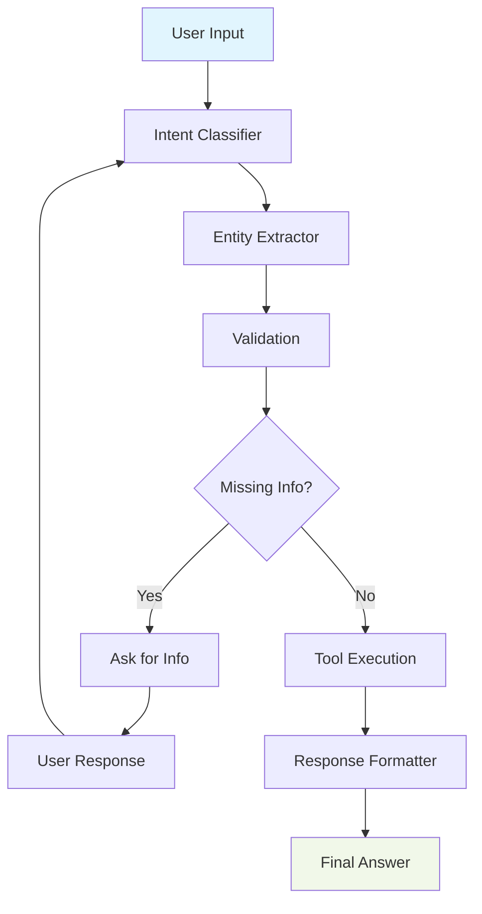

# ExamBuilder LangGraph Agent

AI-powered exam management system built with proper LangGraph architecture.

## 🚀 Quick Start

1. **Setup Environment**:

   ```bash
   cp .env.template .env
   # Add your OPENAI_API_KEY to .env
   ```
2. **Install Dependencies**:

   ```bash
   pip install -r requirements.txt
   ```
3. **Run Application**:

   ```bash
   python start_langgraph_agent.py
   ```
4. **Access Interface**:

   - **Web UI**: http://localhost:8002
   - **API Docs**: http://localhost:8002/docs

## 📋 Features

- **Student Management**: Create accounts, search students
- **Exam Scheduling**: Register students for exams
- **Results Retrieval**: Get detailed exam results and statistics
- **Progressive Conversations**: Context-aware chat interface
- **Real-time UI**: Modern chat interface with auto-scroll

## 🏗️ Architecture



## 💬 Example Usage

- `"I need the list of exams"`
- `"I am john@example.com and want to register for Serengeti Practice Exam"`
- `"My student ID is SAMPLE+123 and I need results for Serengeti Certification"`
- `"I need to create a student account"`

## 🛠️ Tech Stack

- **LangGraph**: StateGraph with proper node architecture
- **FastAPI**: Web server with built-in chat UI
- **Multi-LLM Support**: OpenAI, Google Gemini, and VertexAI
- **LangSmith**: Distributed tracing and telemetry (optional)
- **ExamBuilder API**: Backend exam management system

## 📁 Core Files

- 
-  `agent.py` - Main LangGraph agent implementation
- `fastapi_app_langgraph.py` - Web server with chat UI
- `exambuilder_tools.py` - API integration functions
- `tool_registry.py` - Dynamic tool discovery system
- `config.py` - Configuration management

## 🔧 Configuration

Required environment variables in `.env`:

```bash
# LLM Provider Configuration
LLM_PROVIDER=openai  # openai, gemini, or vertexai
OPENAI_API_KEY=your_openai_key_here  # if using OpenAI
GOOGLE_API_KEY=your_google_key_here  # if using Gemini
GOOGLE_CLOUD_PROJECT=your-project-id  # if using VertexAI

# ExamBuilder API
EXAMBUILDER_API_KEY=FE0F8C82239FF183
EXAMBUILDER_API_SECRET=A227A6838F3D180A15E6D8ED
```

Optional:

```bash
LANGSMITH_API_KEY=your_langsmith_key  # for telemetry
LLM_MODEL=gpt-3.5-turbo
PORT=8002
```

## 🧪 Testing

```bash
python test_langgraph_agent.py
```

## 🎯 LangGraph Implementation

This is a **proper LangGraph agent** with:

- ✅ **StateGraph Architecture**: TypedDict state management with 5 specialized nodes
- ✅ **Node Pipeline**: Intent Classification → Entity Extraction → Validation → Tool Execution → Response Formatting
- ✅ **Conditional Routing**: Smart flow control based on missing information
- ✅ **Memory Persistence**: Thread-based session management with MemorySaver
- ✅ **Dynamic Tool Integration**: Auto-discovery and registration of ExamBuilder API tools

## 📊 LangSmith Telemetry

Built-in observability and monitoring:

- ✅ **Distributed Tracing**: Track requests across all LangGraph nodes
- ✅ **Performance Metrics**: Monitor LLM calls, latency, and token usage
- ✅ **Debug Insights**: Inspect conversation flows and entity extraction
- ✅ **Error Tracking**: Capture and analyze failures in the agent pipeline

---

Built with ❤️ using LangGraph, FastAPI, and Multi-LLM Support
