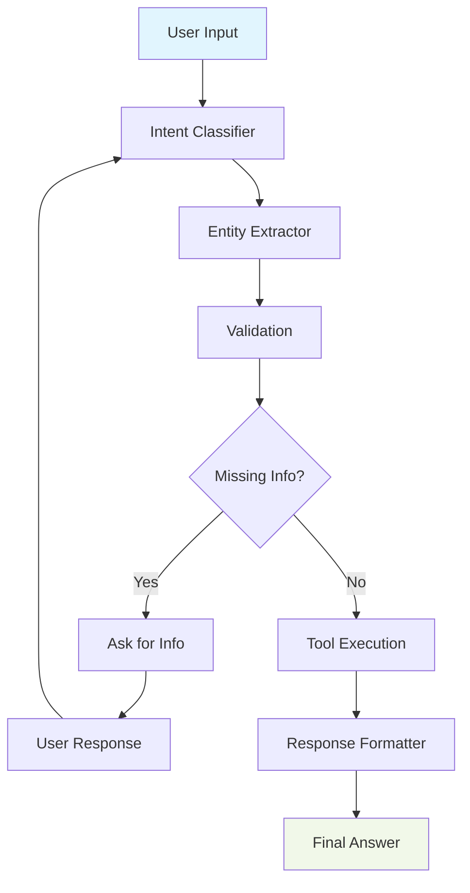

# ExamBuilder LangGraph Agent

AI-powered exam management system built with proper LangGraph architecture.

## 🚀 Quick Start

1. **Setup Environment**:

   ```bash
   cp .env.template .env
   # Add your OPENAI_API_KEY to .env
   ```
2. **Install Dependencies**:

   ```bash
   pip install -r requirements.txt
   ```
3. **Run Application**:

   ```bash
   python start_langgraph_agent.py
   ```
4. **Access Interface**:

   - **Web UI**: http://localhost:8002
   - **API Docs**: http://localhost:8002/docs

## 📋 Features

- **Student Management**: Create accounts, search students
- **Exam Scheduling**: Register students for exams
- **Results Retrieval**: Get detailed exam results and statistics
- **Progressive Conversations**: Context-aware chat interface
- **Real-time UI**: Modern chat interface with auto-scroll

## 🏗️ Architecture



## 💬 Example Usage

- `"I need the list of exams"`
- `"I am john@example.com and want to register for Serengeti Practice Exam"`
- `"My student ID is SAMPLE+123 and I need results for Serengeti Certification"`
- `"I need to create a student account"`

## 🛠️ Tech Stack

- **LangGraph**: StateGraph with proper node architecture
- **FastAPI**: Web server with built-in chat UI
- **OpenAI**: GPT-3.5-turbo for intent classification and entity extraction
- **LangSmith**: Telemetry and tracing (optional)
- **ExamBuilder API**: Backend exam management system

## 📁 Core Files

- 
-  `agent.py` - Main LangGraph agent implementation
- `fastapi_app_langgraph.py` - Web server with chat UI
- `exambuilder_tools.py` - API integration functions
- `tool_registry.py` - Dynamic tool discovery system
- `config.py` - Configuration management

## 🔧 Configuration

Required environment variables in `.env`:

```bash
OPENAI_API_KEY=your_openai_key_here
EXAMBUILDER_API_KEY=FE0F8C82239FF183
EXAMBUILDER_API_SECRET=A227A6838F3D180A15E6D8ED
```

Optional:

```bash
LANGSMITH_API_KEY=your_langsmith_key
LLM_MODEL=gpt-3.5-turbo
PORT=8002
```

## 🧪 Testing

```bash
python test_langgraph_agent.py
```

## 🎯 LangGraph Implementation

This is a **proper LangGraph agent** with:

- ✅ StateGraph with TypedDict state management
- ✅ 5 specialized nodes with clear responsibilities
- ✅ Conditional routing and memory persistence
- ✅ Thread-based session management
- ✅ Dynamic tool integration

---

Built with ❤️ using LangGraph, FastAPI, and OpenAI
