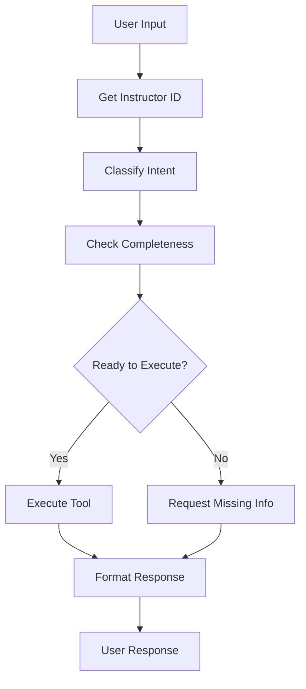

# ExamBuilder LangGraph Agent

A sophisticated LangGraph-based agent that integrates with the ExamBuilder API to provide natural language interfaces for exam management, student administration, and educational analytics.

## 🎓 Features

### Student Management
- **Create Students**: Register new students with personal information
- **Student Search**: Find students by name or other criteria
- **Student Details**: Retrieve comprehensive student profiles
- **Update Records**: Modify student information
- **Delete Students**: Remove student records

### Exam Management
- **List Exams**: View all available exams
- **Exam Details**: Get comprehensive exam information
- **Exam Statistics**: Access detailed performance metrics

### Exam Scheduling
- **Schedule Exams**: Book exam sessions for students
- **Bulk Scheduling**: Schedule exams for multiple students
- **View Scheduled Exams**: List all scheduled exam sessions
- **Cancel Exams**: Unschedule exam attempts
- **Exam Progress**: Reset or add time to exam attempts

### Group Management
- **List Groups**: View all student groups
- **Group Details**: Get group information
- **Group Members**: Manage group membership
- **Unassigned Students**: Find ungrouped students

### Reporting & Analytics
- **Enrollment Reports**: Track exam enrollments
- **Performance Reports**: Analyze student performance
- **Group Analysis**: Compare group performance
- **Date Range Reports**: Generate time-based analytics

## 🏗️ Architecture

The agent uses a **LangGraph workflow** with the following nodes:

1. **Instructor ID Node**: Authenticates and retrieves instructor credentials
2. **Intent Classification**: Uses LLM to understand user requests
3. **Information Completeness**: Validates required parameters
4. **Tool Execution**: Calls appropriate ExamBuilder API endpoints
5. **Response Formatting**: Presents results in user-friendly format

## 📁 Project Structure

```
exam-agent/
├── exambuilder_tools.py      # ExamBuilder API functions
├── exambuilder_agent.py      # LangGraph workflow implementation
├── exambuilder_demo.py       # Interactive demo script
├── README_exambuilder.md     # This file
└── requirements.txt          # Python dependencies
```

## 🚀 Setup

### Prerequisites
- Python 3.8+
- OpenAI API key
- ExamBuilder API credentials

### Installation

1. **Clone the repository**:
   ```bash
   git clone <repository-url>
   cd exam-agent
   ```

2. **Install dependencies**:
   ```bash
   pip install -r requirements.txt
   ```

3. **Configure credentials**:
   ```python
   # In exambuilder_tools.py
   API_KEY = "your_exambuilder_api_key"
   API_SECRET = "your_exambuilder_api_secret"
   
   # Set environment variable
   export OPENAI_API_KEY="your_openai_api_key"
   ```

## 💻 Usage

### Quick Start

```python
from exambuilder_agent import run_exambuilder_agent

# Simple queries
response = run_exambuilder_agent("List all available exams")
response = run_exambuilder_agent("Create a student named John Doe with email john@example.com")
response = run_exambuilder_agent("Schedule exam 12345 for student 67890 tomorrow at 2 PM")
```

### Interactive Demo

```bash
python exambuilder_demo.py
```

### Example Conversations

**Creating a Student:**
```
User: "I need to register a new student"
Agent: "To complete this request, I need:
        • Please provide the student's first name
        • Please provide the student's last name  
        • Please provide the student's email address"

User: "Name is Alice Johnson, email alice.johnson@university.edu"
Agent: "✅ Successfully created student with ID: abc123"
```

**Scheduling an Exam:**
```
User: "Schedule an exam for tomorrow"
Agent: "To complete this request, I need:
        • Please provide the exam ID
        • Please provide the student ID"

User: "Exam ID is 456, student ID is abc123"
Agent: "📅 Successfully scheduled exam! Attempt ID: def789"
```

## 🔧 API Integration

### ExamBuilder API Endpoints

The agent integrates with these ExamBuilder API endpoints:

- **Authentication**: `GET /validate.json`
- **Students**: `GET|POST|PUT|DELETE /instructor/{id}/student.json`
- **Exams**: `GET /instructor/{id}/exam.json`
- **Scheduling**: `GET|POST|DELETE /instructor/{id}/scheduledexam.json`
- **Groups**: `GET /instructor/{id}/group.json`
- **Reports**: `GET /instructor/{id}/report/...`

### Error Handling

The agent includes comprehensive error handling:
- API connection failures
- Authentication errors
- Missing parameters
- Invalid data formats
- Rate limiting

## 🤖 LangGraph Workflow



## 🔍 Supported Intents

The agent can understand and process these types of requests:

- **Student Management**: "create student", "find student", "update student info"
- **Exam Queries**: "list exams", "show exam details", "exam statistics"
- **Scheduling**: "schedule exam", "cancel exam", "show my exams"
- **Groups**: "list groups", "group members", "assign to group"
- **Reports**: "enrollment report", "performance report"

## 📊 Natural Language Processing

The agent uses advanced NLP to:
- **Extract Entities**: Names, IDs, dates, email addresses
- **Parse Dates**: "tomorrow at 2pm", "next Monday", "July 15th"
- **Handle Context**: Multi-turn conversations with memory
- **Validate Input**: Ensure required information is present

## 🛡️ Security & Authentication

- **API Authentication**: Secure credential handling with base64 encoding
- **Input Validation**: Comprehensive parameter checking
- **Error Sanitization**: Safe error message handling
- **Session Management**: Stateful conversation tracking

## 🚨 Error Scenarios

The agent gracefully handles:
- **Invalid Credentials**: Clear authentication failure messages
- **Missing Permissions**: Informative permission error explanations
- **Network Issues**: Retry logic and connection error handling
- **Invalid Input**: User-friendly validation messages

## 🔮 Future Enhancements

Potential improvements:
- **Voice Interface**: Speech-to-text integration
- **Multi-language**: Support for additional languages
- **Advanced Analytics**: Machine learning insights
- **Mobile App**: Native mobile applications
- **Batch Operations**: Bulk data processing capabilities

## 📚 Dependencies

```
langchain-openai>=0.1.0
langgraph>=0.1.0
requests>=2.31.0
python-dotenv>=1.0.0
```

## 🤝 Contributing

1. Fork the repository
2. Create a feature branch
3. Make your changes
4. Add tests
5. Submit a pull request

## 📄 License

This project is licensed under the MIT License.

## 📞 Support

For questions or issues:
- Create an issue in the repository
- Contact the development team
- Check the ExamBuilder API documentation

---

**Built with ❤️ using LangGraph and ExamBuilder API** 